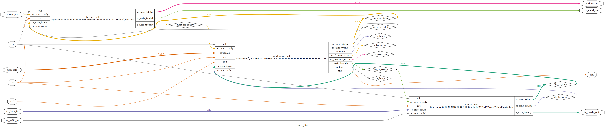
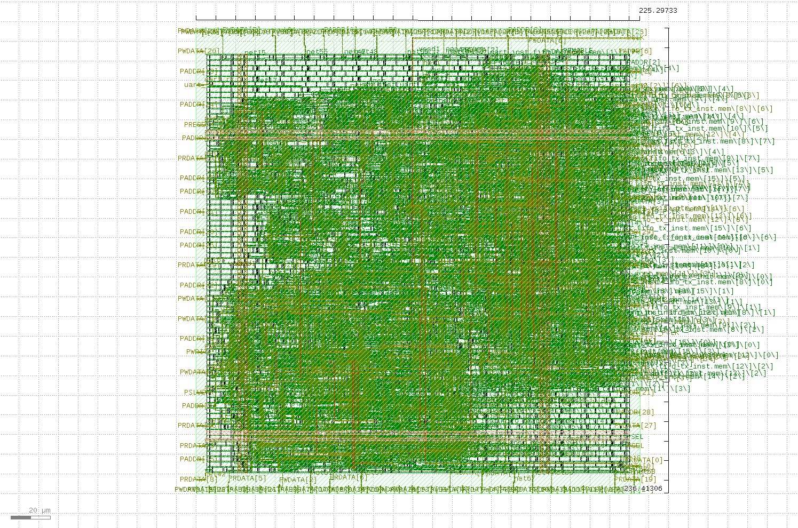
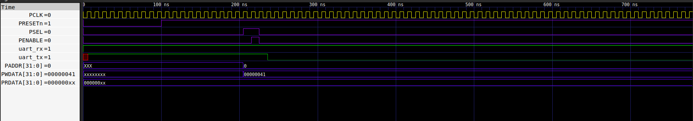
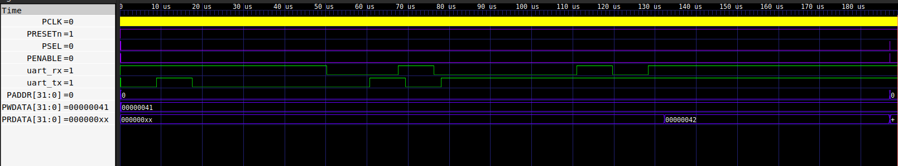
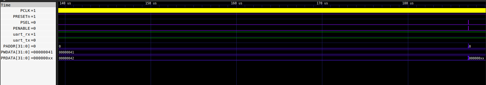

# UART-APB Controller: Full Digital Design Flow (iCE40 FPGA & Sky130 ASIC)

## Project Overview
This repository contains the complete design and implementation of a **UART Controller** with an **APB (Advanced Peripheral Bus) Wrapper**. The project demonstrates a professional dual-target silicon design flow:
1. **FPGA Prototyping:** Validated on **Lattice iCE40-HX8K** for logic functionality.
2. **ASIC Implementation:** Hardened using the **OpenLane** flow on **SkyWater 130nm** Open Source PDK.

## Architecture
The system integrates a UART Core (TX/RX), an AXI-Stream compatible FIFO, and an APB interface for seamless SoC integration.

*Figure 1: RTL Block Diagram & Interconnect*

## ASIC Sign-off Results (SkyWater 130nm)
The design successfully passed all physical verification and timing sign-off stages:
- **Die Area:** 0.0533 mm² ($225.3 \times 223.6 \mu m$)
- **Gate Count:** 1,569 logic gates (Total 5,648 cells including physical cells)
- **Power Consumption:** **4.48 mW** (@ 100MHz, Typical Corner)
- **Timing:** Setup Slack MET (+8.14 ns)
- **Physical Sign-off:** **100% Clean DRC, LVS, and Antenna checks**.

*Figure 2: Final Silicon Layout (GDSII) in KLayout*

## FPGA Verification (iCE40-HX8K)
- **Max Frequency:** **85.30 MHz**
- **Verification Status:** Passed timing analysis and logic verification using the IceStorm toolchain.

## Repository Structure
- `/rtl`: Verilog source code (Core, FIFO, Wrapper).
- `/verification`: Testbenches for logic simulation.
- `/openlane`: Design configuration (`config.json`) and final GDSII.
- `/fpga`: iCE40 placement, routing, and timing reports.
- `/docs`: Detailed sign-off reports (Power, Timing, Area, DRC, LVS, Antenna).

## Post-Layout Verification (Gate-Level Simulation)
The following waveforms verify the UART-APB IP core using the physical gate-level netlist and Sky130 standard cell timing models.

### 1. CPU Write Transaction (Test 1)

* **Description**: CPU writes character 'A' (0x41) via the APB bus.
* **Observation**: The `PWDATA` shows `0x41`, and the `uart_tx` pin correctly initiates the start bit after the internal FIFO process.

### 2. Full Simulation Overview (All Tests)

* **Description**: Macro view of all test cases (Write 'A', Receive 'B', Status Read, and Data Read).
* **Observation**: Continuous operation shows stable clocking and successful data loopback between TX and RX.

### 3. CPU Read Transaction (Test 2)

* **Description**: CPU reads the received character 'B' (0x42) from the RX FIFO.
* **Observation**: The `PRDATA` bus correctly outputs `0x00000042`, matching the character sent to the `uart_rx` pin.

### Conclusion
The GLS results match the RTL functional simulation, confirming that the design is timing-clean and ready for silicon fabrication.

## Tools Used
- **Synthesis:** Yosys
- **Place & Route:** OpenROAD / nextpnr-ice40
- **Sign-off:** Magic (DRC), Netgen (LVS), OpenSTA (Timing)
- **Visualization:** KLayout
